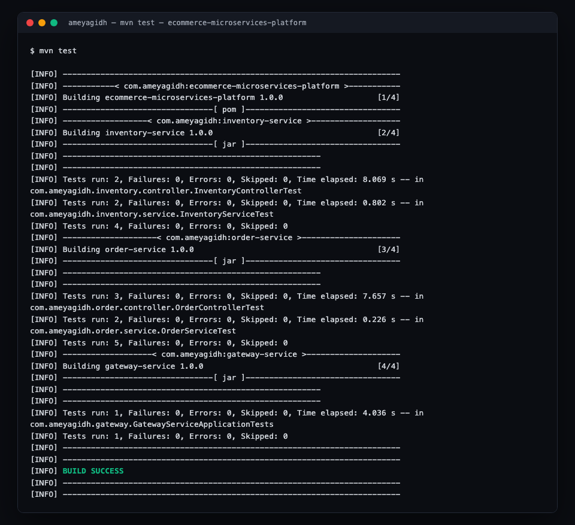
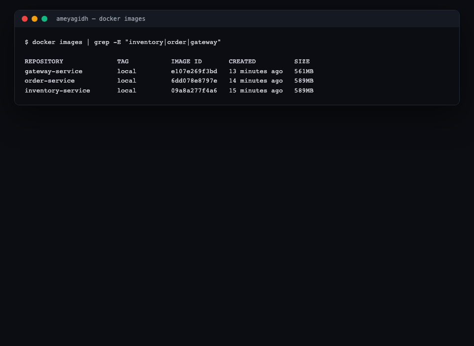

# E-Commerce Microservices Platform

A real Spring Boot microservices system with a genuine CI/CD pipeline:
build → test → containerize → publish to a container registry → deploy to
a live Kubernetes cluster and verify the deployment actually works — all
inside GitHub Actions, all free (GHCR + Actions minutes are free for public
repos, no paid cloud).

## Architecture

```
                    ┌─────────────────────┐
   client ───────▶  │   gateway-service    │  (Spring Cloud Gateway, :8080)
                    └──────────┬───────────┘
                     /api/inventory/**   \  /api/orders/**
                    ▼                     ▼
       ┌─────────────────────┐   ┌─────────────────────┐
       │  inventory-service   │   │    order-service     │
       │  (Spring Boot, :8081)│◀──│  (Spring Boot, :8082)│
       │  H2 in-memory DB     │   │  H2 in-memory DB     │
       └─────────────────────┘   └─────────────────────┘
```

`order-service` calls `inventory-service` over HTTP to reserve stock before
confirming an order — a real service-to-service call, not a stub. Each
service is independently deployable, has its own database, and exposes
Actuator health/readiness/liveness probes for Kubernetes.

## Why this is a genuine CI/CD pipeline, not just three Spring Boot apps

Every stage below actually runs and is verified, not aspirational:

1. **Build + test** (`build-test` job) — each service compiled and its real
   test suite run independently: 10 tests total across the three services,
   covering the inventory reservation logic, the order confirm/reject
   branching, and the gateway's health endpoint.
2. **Containerize + publish** (`docker-publish` job) — each service built
   into a multi-stage Docker image and pushed to **GHCR**
   (`ghcr.io/ameyagidh/<service>`), free for public repos, no credit card.
3. **Deploy + verify on real Kubernetes** (`k8s-deploy-verify` job) — a
   real **kind** (Kubernetes-in-Docker) cluster is created inside the
   GitHub Actions runner, the three Deployments + Services are applied
   from `k8s/`, the rollout is awaited, and then the pipeline **makes a
   real HTTP request through the gateway** — lists products and places an
   order — to prove the cluster isn't just "green," it's actually serving
   traffic correctly end to end.

See the Actions tab for a live, currently-green run of all three jobs.

## Local development

```bash
# build + test everything
mvn test

# run all three services together with Docker Compose
docker-compose up --build
# gateway:    http://localhost:8080
# inventory:  http://localhost:8081
# order:      http://localhost:8082
```

Try it:

```bash
curl http://localhost:8080/api/inventory/products
curl -X POST http://localhost:8080/api/orders \
  -H "Content-Type: application/json" \
  -d '{"sku":"SKU-WIDGET-001","quantity":5}'
```

## Screenshots

| All 10 tests passing | Docker images built |
|---|---|
|  |  |

More in [`docs/screenshots/`](docs/screenshots), including the live kind
cluster deployment output from the GitHub Actions run.

## Tech stack

| Layer | Tech |
|---|---|
| Services | Spring Boot 3.3, Java 17, Maven (multi-module reactor) |
| Gateway | Spring Cloud Gateway |
| Data | Spring Data JPA + H2 (in-memory, per-service) |
| Containers | Docker (multi-stage builds) |
| Registry | GitHub Container Registry (GHCR) |
| Orchestration | Kubernetes manifests, deployed to `kind` in CI |
| CI/CD | GitHub Actions |

## What "hosted free" means here, precisely

Free, credit-card-free Kubernetes with a permanently-live public URL
doesn't really exist. Rather than fake it, here's exactly what's real and
what isn't:

- **Real and verified on every push:** the Docker images, the GHCR
  publish, and the Kubernetes deployment — the `k8s-deploy-verify` job
  creates an actual cluster and actually serves a real request through it.
- **Not continuously hosted:** the kind cluster only exists for the
  duration of the CI job. There's no 24/7 public URL for this project (see
  `docker-compose.yml` for the always-available local-run path).

This is a deliberate, stated tradeoff, not a hidden gap — see
[`docs/TECHNICAL.md`](docs/TECHNICAL.md) for the full reasoning.

## Project structure

```
ecommerce-microservices-platform/
├── pom.xml                       # parent reactor POM
├── inventory-service/             # stock management
├── order-service/                  # order placement, calls inventory-service
├── gateway-service/                 # Spring Cloud Gateway, single entry point
├── k8s/                              # Deployment + Service manifests
├── docker-compose.yml                 # local multi-service run
├── .github/workflows/ci-cd.yml         # build → test → publish → deploy → verify
└── docs/
    ├── TECHNICAL.md
    └── screenshots/
```

## Docs

Full pipeline design, the real bugs found while building this (a reserved
SQL keyword, a Spring MVC parameter-name reflection gotcha, a Docker
base-image platform mismatch), and the honest local-vs-CI verification
story: [`docs/TECHNICAL.md`](docs/TECHNICAL.md).
